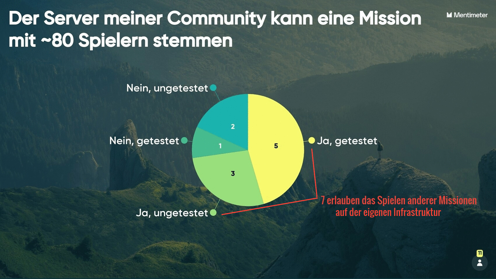
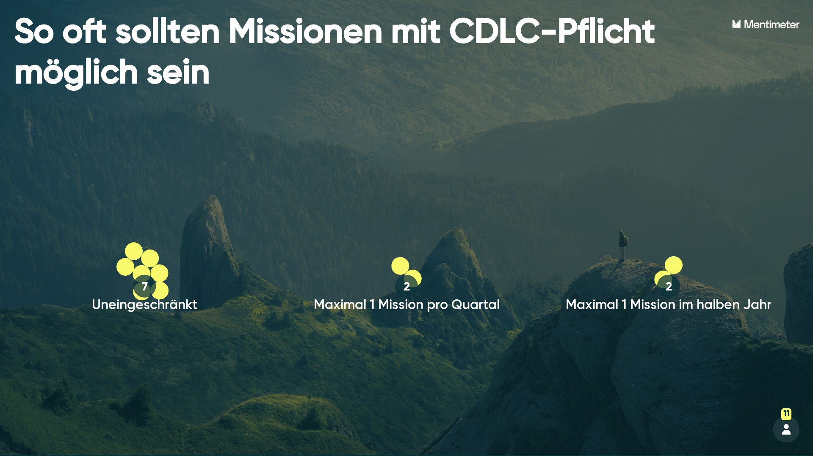

# 2021-08-13 Ergebnis Initiale Umfrage

## Infrastruktur

<figure><figcaption></figcaption></figure>


Mit diesem Ergebnis können wir den reibungslosen Lauf sicherstellen und haben genügend leistungsstarke Server


### Fragen/Anmerkungen zur Infrastruktur

* Wär mal cool die Hardware specs der anderen Communitys zu wissen.
* Wir sind bereit Missionen anderer Communities auf unserer Infrastruktur zu hosten, solange rechtzeitig und klar kommuniziert wird welche Mods (mit Version) auf dem Server laufen sollen. Außerdem muss die Mission mindestens eine halbe Stunde vorher eingereicht werden.

## Modpack

<figure><figcaption></figcaption></figure>

<figure><figcaption></figcaption></figure>

<figure><figcaption>
<em>Keine Anpassung wurde von der Gruppe gewählt, die nur alle 2-3 Monate teilnehmen möchte</em>
</figcaption></figure>

### Fragen/Anmerkungen zum Modpack

* Wir sollten besprechen welche Fraktionen und Szenarien das Modset abdecken soll. _(Für 3 GB gestimmt)_
* 3GB zum anpassen sind recht klein, das ist mit einem Terrain gefüllt und es ist kein Platz mehr für weitere Fraktionen. Lieber ein schlankeres Standard Modset und dafür ein bisschen mehr Spielraum für Missionsersteller. _(Für Beliebig gestimmt)_

## Zeitplanung

Mit Ausnahme der Gruppe, die nur alle 2-3 Monate teilnehmen möchte, haben alle für den letzten Samstag in jedem Monat mit der vorgeschlagenen Uhrzeit gestimmt. 2 Gruppen betonen explizit, dass auch gerne längere Missionen möglich sind.

### Fragen/Anmerkungen zur Zeitplanung

* Techsupport?
* Warum sich auf einen Wochentag festlegen? Am besten entscheidet das die ausrichtende Community
* Teilnahme an einer Nachbesprechung sollte nicht verpflichtend sein. Inputs können per Discord später erfolgen

## Sonstige Anmerkungen und Fragen

### Zum Missionsbau

* Am besten schon viele Missionsrelevanten Dinge im Vorfeld veröffentlichen, damit die Leads sich Gedanken machen können und es in der Mission reibungsloser zugeht.
* Zwischen den Missionen sollte es standardisierte ACE3 Medic Einstellungen geben.
* Der Zeus kann also auch mitspielen, wenn er/sie nur regelmässig mal schauen muss ob alles im Rahmen läuft?
* Nicht-Onelife-Events sind uns ehrlich gesagt fremd, daher kann ich nicht einschätzen wie das bei unserne Mitglieder_innen und Mitspieler_innern ankommt. Ich finde es aber gut, dass es keine Zwang in eine der beiden Richtungen gibt.

### Innerhalb der Mission

* One life und andere Hardcore-Einstellungen sollten vorher kommuniziert werden.
* Führungsbriefings sollten im Spiel so kurz wie möglich und am Besten vor dem Spiel gehalten werden.

### Zum Discord

* Nur für Ansprechpartner der Gruppen + Missionsbauer/Planer
* Der Discord sollte für alle Teilnehmer zugänglich sein, mit speziellen Rollen und Kanälen für Vertreter, Missionsbauer, Events und zur Planung.

### Sonstiges

* Wir starten unsere Missionen meist schon früher und könnten auch gerne Rollen übernehmen die evtl. schon früher starten z.B. Aufklärer :) _(SC)_
* Man könnte die einzelnen Gruppen auch mal fragen wo die Hauptinteressen sind. Manche Gruppen spielen eine bestimmte Einheit; hauptsächlich Infanterie; reguläre Kräfte; Spezialeinheiten; Motorisiert; zu Fuß unterwegs; etc. . Das wäre auch eine gute Übersicht für die Zeuse
* Zug- und Gruppenplanung sollte vor der Mission als PDF zur Verfügung stehen
* Keine Einschränkungen für Streamer, außer bei TvT Missionen; Es wäre wünschenswert wenn Streamer vor der Mission den Link zu ihrem Stream teilen
* Keine Strafe für zu spät kommen, sofern es begründet werden kann, oder bereits im Vorlauf kommuniziert wurde
* Gemeinsames Verständnis des Zusammenspiels um Differenzen zwischen Gruppen und den unterschiedlichen Spielweisen vorzubeugen, Stichwort Kompromissbereitschaft.

## Statistik

<figure><figcaption>
<strong>ACRE</strong>: [A] XDrake, [W] Peer, [NTF] Samsung, [3.JgKp] nordlurch, [AMB] Mäxo; <strong>TFAR</strong>: [Prae] Niggo, [TTT] SchmidtLR, [WOLF] KiritoKun223, [KeKo] C4ll_me_Nomad, [TB] Mike Range, [SC] PotatoWarrior, [niCe] Viktor
</figcaption></figure>

<figure><figcaption></figcaption></figure>
