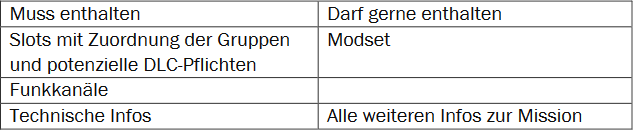

# 2021-09-05 Detailklärung 1


Gruppe Adler (Reacher, XDrake, Eras), KeKo (C4ll\_me\_Nomad), NTF (Nitro Nic, Parrot), SC (Akanto, Fox), TB (IDarky, Mike Range, shukari), Gruppe W (Peer), Wolf Corps (Alex Mason, KiritoKun223), AMB (Alf, Shiro)


#### Zeitplanung

1. Techcheck
   1. Immer eine Woche vor der Mission.
   2. Verfügbar ist auch auf Anfrage, dass eine Community für ein paar Stunden testen kann.
2. Nachbesprechung
   1. Freiwillige Anwesenheit.
   2. Teamleads werden gebeten, bei aufgefallenen Dingen, diese nach der Mission in der Runde anzusprechen.
   3. Jeder Mitspieler, der möchte, kann dableiben und nach den Teamleads Feedback geben.
   4. Zusätzlich wird jedem Mitspieler ermöglicht Feedback schriftlich abzugeben.

#### Discord

1. Um die Missionsplanung, vor allem mit Teamleads, einfacher gestalten zu können, wird der Discord für jeden geöffnet.
   1. Für den einfachen und schnellen Austausch bleiben die aktuellen Kategorien Vertreter-Exklusiv.
   2. Für die Spielermenge gibt es nur den Allgemeinkanal schriftlich zugänglich. Freigeschaltete Events können, mit Ausnahme des Führungspersonals, nur gelesen werden.

#### Zusammenspiel und Planung

1. Das Auffüllen der zugeordneten Slots bleibt jeder Community selbst überlassen.
   1. Dies beinhaltet auch die Möglichkeit leere Slots durch andere besetzen zu lassen.
2. Verspätungen werden durch die Systeme der einzelnen Communitys geregelt.
3. Slotliste
   1. Wir starten mit einem Google Docs Formular.
   2. Gerne dürfen Templates zur Orientierung oder gemeinsamen Verwendung geteilt werden.
   3. Die Slotliste... 
4. Varianz
   1. Durch die vielen verschiedenen Missionsbauer kommt Varianz von ganz selbst.
   2. Es ist keine feste Regelung zur Menge und Verwendung von DLC-Pflichten von Nöten.

#### Namensfindung

1. Unter Beachtung der vorausgegangenen Umfrage und weiterführende Diskussion wurde sich auf den Namen „**D**eutsche **A**rma **A**llianz“ geeinigt.

#### Modset

1. Wir halten an der 3 GB Grenze für missionsspezifische Anpassungen des Modpacks als grobe Richtlinie fest.
   1. Ausgenommen von dieser Regelung ist die zu bespielende Karte.

#### Einladungen

1. Aufgrund der technischen Beschränkungen und der bereits erreichten Community-Anzahl werden vorerst keine weiteren Communitys eingeladen.
   1. Zukünftig wird sich hier zeigen, ob ein zweiter Rhythmus sinnvoll ist.

#### Offene Punkte

Es soll sich eine Expertengruppe zusammensetzen, die über einheitliche Einstellungen der Modifikationen spricht und ein Ergebnis erarbeitet, dass in jeder Mission verwendet werden soll. Des Weiteren wurde dieser Gruppe die Aufgabe übertragen, die Funktionalitäten der Modifikationen mit der Markierung „Funktion testen“ zu überprüfen.

In der Vertreterrunde sollen noch Empfehlungen für clientseitige Mods erarbeitet werden, um ein sehr gutes Erlebnis bieten zu können.
